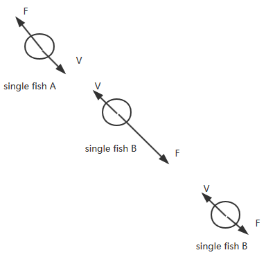

## MyWallPaper
A project on Android 3D wallpaper （OpenGL ES）,the IDE is Android Studio2.4.1,the version is old,you can open this project with a higher version Android Studio.

There are  some Swimming fish,these fish are divided into a single fish and fish school,the bule fish is single,the red fish and the orange is fish school .it use one AI(Artificial intellgence ) algorithm ,it is improtant  in this project.The background uses a texture rectangle,the fish model and the shell uses skeletal animation,i don't uses the FBX,use a custom bone animation.The project  involve some physics and 3D math.

## Run Result

This gif is compressed,so it may not be very clear.

## AI Fish algorithm

it simulate the real world,for example,speed,force and other Details,the picture can only vaguely introduce this algorithm,i omitted some details,can read the class from the folder--fish and fishschool.

